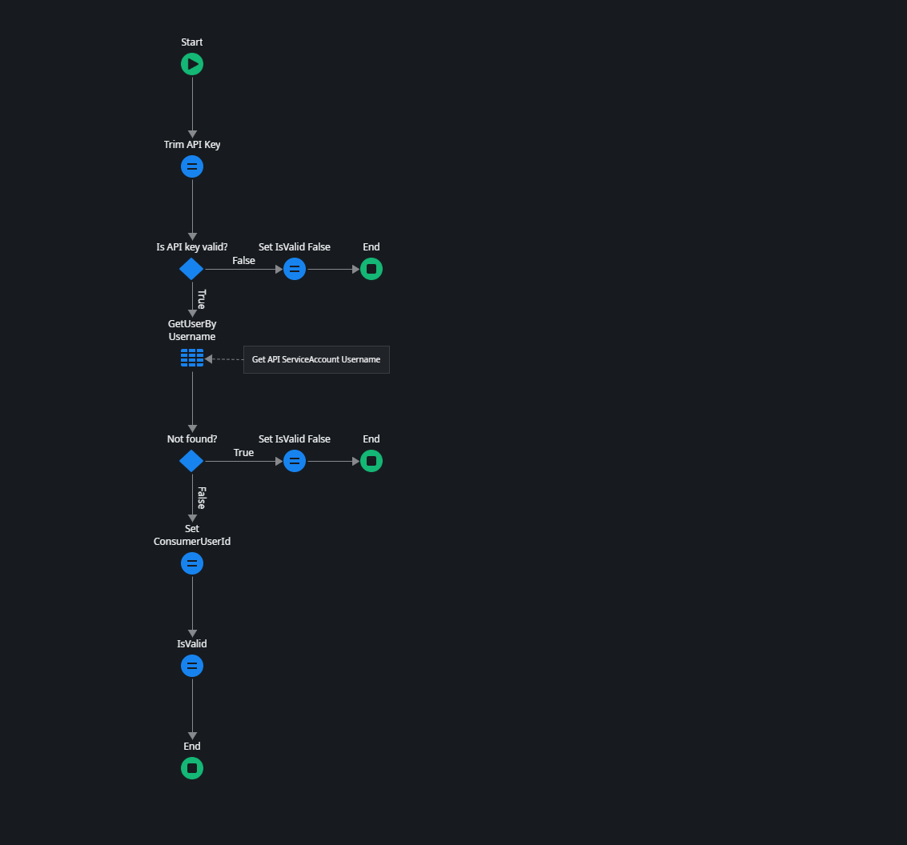

# {{page.title}}

    This page is under construction

See [Add Custom Authentication to an Exposed REST API]

In this how-to we'll demonstrate the following custom authentication methods:

* [API key](#api-key)
* [OAuth token](#oauth-token)

* TOC
{:toc}

## API Key

When using api key for authentication you need a method to associate api-keys with a consumer user. For this you can create a api key management solution.

To keep the example simple we use site properties to store the api key and the associated user.

It is recommended that you create your own api key management solution based on your business needs. This can be a token per Customer, or per user with an API Key self service. Like the one's OutSystems is providing for their API's. E.g. [AI Mentor Studio API authentication]

### API Key validation

1. Create a site property:
    * Name: API_Key
    * Description: The "secret" x-api-key that is shared with the api consumer.
    * Data type: Text
1. Create another site property:
    * Name: APIServiceAccountUserName
    * Description: The username that's associated with the API Key
    * Data type: Text
1. Create a Service Action
    * Name: APIKeyValidate
    * Description: Checks if the API Key is valid and retrieves the associated userid when valid.
    * Add an input parameter: APIKey, Data type: Text
    * Add an Output parameter: IsValid Data type: Boolean
    * Add an Output parameter: ConsumerUserId, Data type: User Identifier
1. Add the logic
    * Trim the APIKey
    * Add an if: `APIKey <> "" and APIKey=Site.APIKey`
    * In the false branch set isvalid = false
    * In the true branch add an agregate
    * Add the user entity to the aggregate
    * Add a filter to the aggregate: `User.Username = Site.APIServiceAccountUserName`
    * Add an If `GetUserByUsername.List.Empty`
    * In the true branch set IsValid=False and end
    * In the false branch add an assign
    * Set ConsumerUserId = GetUserByUsername.List.Current.User.Id
    * Set Isvalid = True
    * End

Your action flow should now look like this 

### Custom Authentication

Set the API authentication property to custom. This adds an OnAuthentication callback action.

Add the following depencies:

* System - Login
* HTTPRequestHandler - GetRequestHeader

In the OnAuthentication flow add the following actions:

1. GetRequestHeader
    * HeaderName : "x-api-key"
1. APIKeyValidate
    * APIKeyL GetRequestHeader.Value
1. Add an If
    * APIKeyValidate.IsValid = True
1. In the false branch add REST_RaiseErrorByID
    * HTTPStatusId: Entities.HTTPResponseStatus.HTTP401
1. Add an End flow to the false branch
1. In the true branch add a Login
    * UserId: APIKeyValidate.ConsumerUserId
    * Pesistent: False
1. Hide the Unexpected Login Warning
1. Add a comment next to the login: "Hide Enxexpected Login warning."

Your action flow should now look likt this: 

## OAuth token

* [] TODO

### References

* [Securing Your OutSystems APIs With OAuth 2.0]
* [Exposing an OutSystems REST service with an OAuth-style authorization]
* [Protect OutSystems REST APIs using OpenID Connect]

[Securing Your OutSystems APIs With OAuth 2.0]: https://www.outsystems.com/blog/posts/securing-outsystems-apis-oauth2/
[Exposing an OutSystems REST service with an OAuth-style authorization]: https://itnext.io/exposing-an-outsystems-rest-service-with-an-oauth-style-authorization-fded258cbe14
[Protect OutSystems REST APIs using OpenID Connect]: https://medium.com/itnext/protect-outsystems-rest-apis-using-openid-connect-87a2ac7575c1
[Add Custom Authentication to an Exposed REST API]: https://success.outsystems.com/documentation/11/extensibility_and_integration/rest/expose_rest_apis/add_custom_authentication_to_an_exposed_rest_api/
[AI Mentor Studio API authentication]: https://success.outsystems.com/documentation/11/reference/outsystems_apis/ai_mentor_studio_api/ai_mentor_studio_api_authentication/
